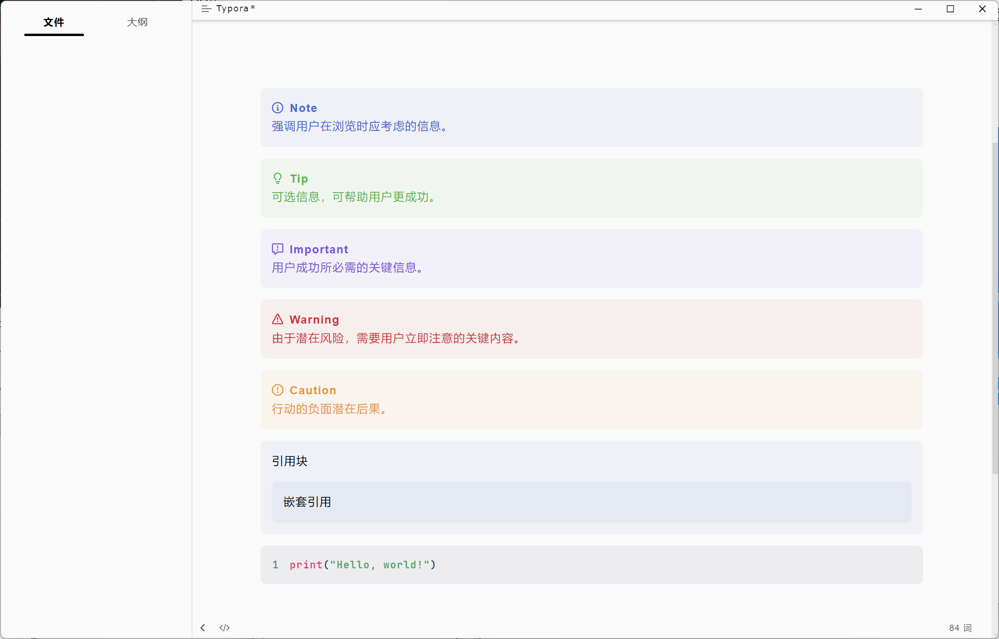
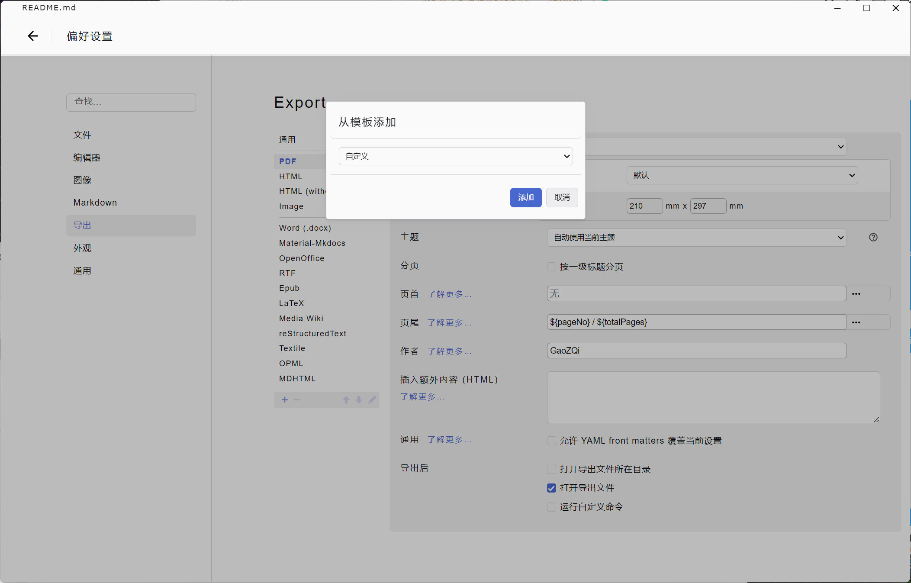
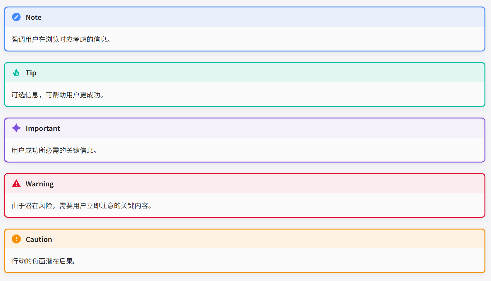

# mdmdt-plug

该项目对Mdmdt主题，进行了部分修改，同时提供了适用于Material-Mkdocs的配套转换脚本和CSS文件。

> [!NOTE]
>
> Mdmdt极简文档主题，是轻度定制的个性化Typora主题。
>
> 主题主页下载地址：
> https://gitee.com/cayxc/mdmdt
> https://github.com/cayxc/Mdmdt

## 主题修改效果



- 调整了提示快样式使其与引用块，代码块的样式更符合。
- 修改了代码字体，调整代码字重。


## Material-Mkdocs

### 保存脚本

由于提示块语法不同，在`typroa-theme\sprict`中提供了转换脚本，可以自动将语法转换为Material-Mkdocs中的提示块语法。

#### 使用方法

1. 打开`Typora>偏好设置>导出>+`添加导出选项，选择自定义。

    

2. 在命令窗口中填写下面的指令；选择导出路径，选择导出的文件位置；目标文件拓展名填写`.md`。
    ```bash
    python "[脚本路径]" "${currentPath}" "${outputPath}"
    ```

### 主题



#### 使用方法

参考[告诫- --- Admonitions - Material for MkDocs (squidfunk.github.io)](https://squidfunk.github.io/mkdocs-material/reference/admonitions/)最后一部分的自定义，所需要的CSS文件位于`material-mkdocs`文件夹中。

